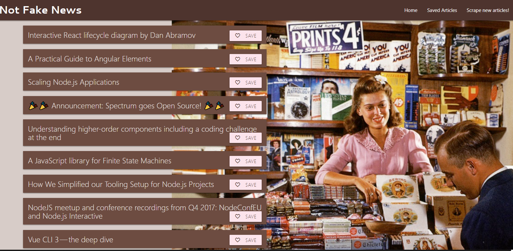

## Not Fake News
This application lets users view and leave comments on the latest news. This is accomplished by using MongoDB/Mongoose and Cheerio to scrape news from another site.

## Getting Started
Play here: https://glacial-ocean-99559.herokuapp.com/

## Technologies Used
- MongoDB/Mongoose
- Node.Js
- Express
- AJAX
- MVC
- Handlebars
- jQuery
- Materialize
- Google Fonts
- Heroku

## Screenshots

## Built With

- Brackets- Text Editor
- Bootstrap- Wireframe

## Future Development

- Indicator that article has been saved
- Ability to add notes to saved articles
- Ability to delete saved articles

## Authors

* Alycia Riley
* [www.code-retro.com](http://www.code-retro.com)

